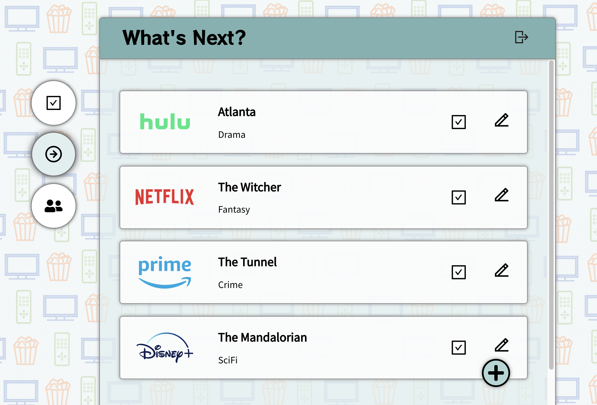
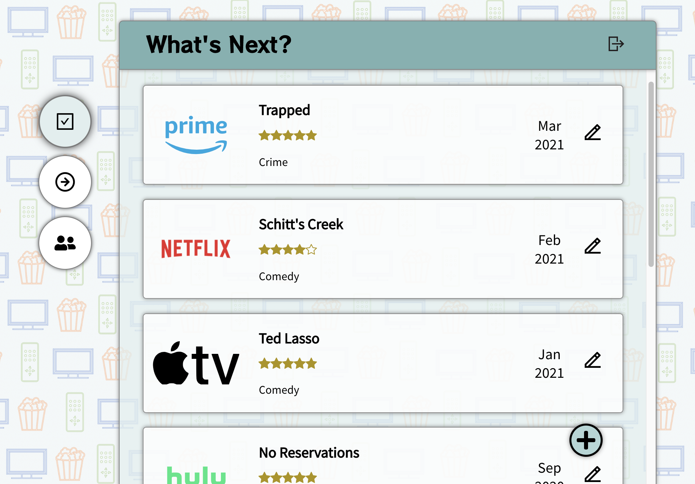
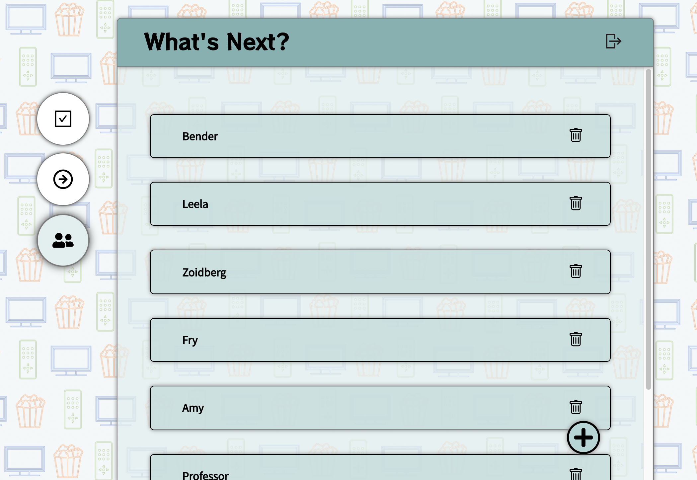
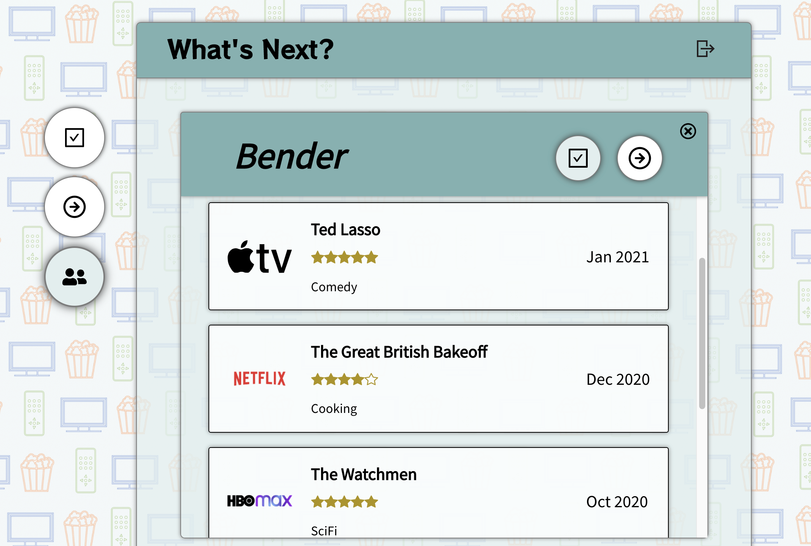

# What's Next?

Use the Vercel-hosted app [here](https://whats-next-five.vercel.app), and find the repo for the associated API [here](https://github.com/sam1cutler/WhatsNextAPI).

## General Description
*Streamline your streaming!* Do you ever get a recommendation from a friend about a new show to watch, but then can't recall the recommendation a month later? Do you vaguely remember watching a really good British crime show like 3 years ago, but can't remember the show's title or streaming service? Do you want to quickly find a fun comedy, available on Netflix, that a friend watched and enjoyed sometime in the last month? If you answered "yes" to any of these questions, then <b>What's Next?</b> is for you!

## Summary
Whenever a friend mentions a show they just loved... or you read a review of a new show online... or you scroll past a show that looks cool on your way to finding the show you meant to watch - don't forget about that new show!

Open up <b>What's Next?</b>, and add the new show to your Watch List, including the streaming service the show is available on and its genre. 

Once you've finished a show, move it <i>out</i> of your Watch List and <i>into</i> your Watched Log. And when you do, you have the option to add a rating.

Now, when a friend asks you about that kinda weird but very cool SciFi show you watched on HBO Max a couple years ago, you know just where to look to find it!

Create a network of friends who use the app... 

...and easily view their lists of "To-watch" and "already-watched" shows.

## Technology used
This React project was bootstrapped with [Create React App](https://github.com/facebook/create-react-app), with elements of Javascript, JSX, HTML, and CSS, React Router, React Hooks, and testing with Jest.

## Contact me
You can find [my GitHub page here](https://github.com/sam1cutler).

## Acknowledgements
This app is a full-stack capstone project for the Thinkful software engineering program. Special thanks to Vincent Ramdhanie for guiding the creation of the app. 
